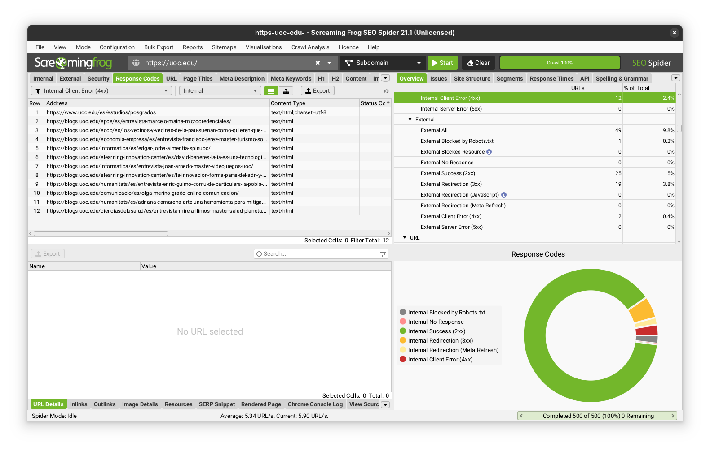
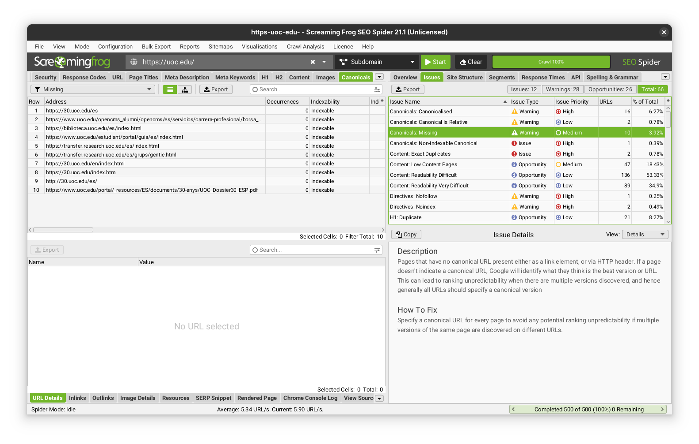

# CA 2
Alejandro Pérez Bueno
Nov 14, 2024

- [Exercise 1](#exercise-1)
  - [a)](#a)
  - [b)](#b)
- [Exercise 2](#exercise-2)
  - [a)](#a-1)
  - [b)](#b-1)
  - [c)](#c)



## Exercise 1

### a)

#### **New Entities**

- **SUPPLIER**: This entity would store information about the new
  product suppliers.

  - Attributes: `supplier_id` (primary key), `supplier_name`,
    `contact_person`, `email`, `phone`, `address`.

    - Data manipulation operations:
      - `add_supplier`: Inserts a new supplier into the SUPPLIER table.
      - `modify_supplier`: Updates supplier information in the SUPPLIER
        table.
      - `delist_supplier`: Logically removes a supplier from the
        SUPPLIER table.

- **PREMIUM_CUSTOMER**: This entity represents customers who have signed
  up for the premium program. It would be a specialized entity
  inheriting from the CUSTOMER entity.

  - Attributes: `customer_id` (primary key, foreign key referencing
    CUSTOMER), `points_balance`.

    - Data manipulation operations:

      - `register_premium_customer`: Creates a new PREMIUM_CUSTOMER
        record when a customer enrolls in the premium program. This
        operation should also add the customer to the CUSTOMER table if
        they are not already registered.
      - `update_points`: Updates the `points_balance` for a
        PREMIUM_CUSTOMER after a purchase.
      - `redeem_points`: Allows a PREMIUM_CUSTOMER to redeem points for
        discounts or other rewards.
      - `cancel_premium_customer`: Removes a customer from the
        PREMIUM_CUSTOMER table when they cancel their premium
        membership.

- **PROMOTION**: This entity stores information about the various
  promotions being offered.

  - Attributes: `promotion_id` (primary key), `promotion_name`,
    `start_date`, `end_date`, `description`.

    - Data manipulation operations:

      - `add_promotion`: Adds a new promotion to the PROMOTION table.
      - `modify_promotion`: Updates the details of an existing
        promotion.
      - `remove_promotion`: Deletes a promotion from the PROMOTION
        table.

#### **New Relationships**

- **SUPPLIES**: This relationship connects the SUPPLIER entity to the
  PRODUCT entity. It represents which suppliers provide which products.
  This relationship is M-N because a supplier can supply multiple
  products, and a product can be supplied by multiple suppliers.

  - Attributes: None.

    - Data manipulation operations: No specific operations are required,
      as this relationship is managed by the operations that add and
      remove products from the catalogue.

- **INCLUDED_IN**: This relationship connects the PRODUCT entity to the
  PROMOTION entity. This relationship is M-N because a product can be
  part of multiple promotions, and a promotion can include multiple
  products.

  - Attributes: `quantity` (the number of units of the product required
    to qualify for the promotion), `free_product_id` (foreign key
    referencing PRODUCT, if applicable). This attribute would store the
    ID of the product offered for free in a “buy X, get Y free”
    promotion.

    - Data manipulation operations:

      - `add_product_to_promotion`: Adds a product to a promotion.
      - `remove_product_from_promotion`: Removes a product from a
        promotion.

#### **Modifications to Existing Operations**

- **`list_product`**: This operation would need to be modified to
  include the `supplier_id` as an input parameter. This ensures that
  newly added products are associated with their corresponding supplier.

- **`calculate_order_total`**: This operation needs modification to
  factor in discounts offered to PREMIUM_CUSTOMERs and promotional
  discounts based on the `INCLUDED_IN` relationship.

#### **New Operations**

- **`apply_promotion`**: This operation would be executed during the
  checkout process to check if any promotions apply to the customer’s
  order and adjust the order total accordingly.

These modifications enhance the existing conceptual model by allowing
for:

- **Supplier management**: The addition of the SUPPLIER entity allows
  the toy company to manage its supplier network efficiently.
- **Promotion creation and management**: The toy company can define
  various types of promotions and associate them with specific products.
- **Premium customer management**: The toy company can track
  PREMIUM_CUSTOMERs and their points balance, enabling personalized
  offers and rewards.

> [!NOTE]
>
> The data manipulation operations associated with each new entity and
> relationship ensure data integrity and consistency. The modifications
> to existing operations and the creation of new operations support the
> new functionalities and integrate them seamlessly with the existing
> system.

### b)

The image positions technology and marketing as integral components of
gamification. When applied to an online store’s promotion system, both
elements play critical roles in implementation.

**Technology** underpins the entire gamified promotion system.
**Screaming Frog SEO Spider** is a software tool that can analyze
various aspects of a website, including page titles, meta descriptions,
and internal linking. It helps identify technical SEO issues and
provides data that can be used for optimization. These technical
capabilities are essential for implementing gamified elements like point
tracking, leaderboards, and achievement badges. A robust database, as
discussed in our previous conversation and exemplified in source, is
crucial for storing and managing the data generated by customer
interactions within the gamified system.

**Marketing** leverages technology to create engaging and effective
promotional campaigns. Marketing strategies in e-commerce rely heavily
on data analysis and customer relationship management (CRM). A data
warehouse, described in source, serves as a repository of historical
data from various sources, including the operational database, which can
be used for analyzing customer behavior and preferences. This data
empowers marketing teams to design gamified promotions tailored to
specific customer segments, driving engagement and encouraging desired
actions. For example, Screaming Frog SEO Spider can be used to track the
performance of different landing pages and identify areas for
improvement, which can inform the design of gamified elements within
those pages.

## Exercise 2

### a)

**SEO** (Search Engine Optimization) is the practice of optimizing a
website to improve its visibility in organic search engine results,
while **SEM** (Search Engine Marketing) is a broader term that
encompasses both SEO and paid search advertising strategies, such as
Pay-Per-Click (PPC) campaigns. Here are some differences among the two
found on the internet:

- **Cost**: SEO is generally cost-effective over time, focusing on
  organic strategies, while SEM involves ongoing costs for paid
  advertising.

- **Speed**: SEO takes time to show results, often months, whereas SEM
  can provide immediate visibility through paid ads.

- **Sustainability**: SEO offers long-term, sustainable traffic growth,
  while SEM traffic stops when ad spending ceases.

- **Components**: SEO focuses on optimizing for organic search results,
  while SEM includes both SEO and paid search strategies like PPC.

- **Goal**: SEO aims to improve organic rankings, while SEM seeks to
  increase visibility through both organic and paid methods.

- [SEO vs SEM: Key
  Differences](https://wegic.ai/blog/seo-vs-sem-key-differences.html)

- [What’s The Difference Between SEO and
  SEM?](https://www.linkedin.com/pulse/whats-difference-between-seo-sem-intellezy-lvxkc)

### b)

#### Link Building

Link building is crucial for establishing authority and trustworthiness.
In e-commerce, acquiring high-quality backlinks from reputable sites
signals to search engines that your site is credible. Techniques include
guest blogging, influencer partnerships, and creating shareable content.
Quality over quantity is essential, as links from authoritative sites
carry more weight and can significantly boost search rankings.

#### Social Media Engagement

Active social media presence enhances brand visibility and drives
traffic to your e-commerce site. Sharing engaging content, interacting
with followers, and leveraging platforms like Instagram and Pinterest
can increase brand awareness and generate backlinks. While social
signals aren’t direct ranking factors, they contribute to overall online
presence and can indirectly influence SEO by driving traffic and
engagement.

#### Online Reviews and Reputation Management

Positive reviews and a strong online reputation build trust with
potential customers and search engines. Encourage satisfied customers to
leave reviews on platforms like Google My Business and Yelp. Responding
to reviews, both positive and negative, shows engagement and can improve
customer perception. A strong reputation can lead to increased
click-through rates and conversions, positively impacting search
rankings.

- [Understanding On-Page and Off-Page E-commerce
  SEO](https://blog.bluetuskr.com/on-page-and-off-page-seo-ecommerce)
- [What Is Off-Page SEO?](https://www.semrush.com/blog/off-page-seo/)

### c)

I have run *Screaming Frog* on the site [uoc.edu](https://uoc.edu), as
seen on these images:

Here are the three issues found and my proposed solutions to each of
them:

1.  **Non-Indexable Canonical:**
    - **Description:** This issue occurs when a page has a canonical URL
      that is non-indexable, meaning it might be blocked by
      `robots.txt`, have no response, or return errors. This can confuse
      search engines and lead to indexing issues.
    - **Fix:** Ensure that canonical URLs point to indexable pages by
      checking for any blocks in `robots.txt`, resolving any server
      errors, and ensuring the canonical page is not set to “noindex.”
2.  **Missing Canonicals:**
    - **Description:** Pages without a canonical URL can lead to ranking
      unpredictability, as search engines may not know which version of
      a page to prioritize.
    - **Fix:** Specify a canonical URL for each page to guide search
      engines in identifying the preferred version, especially when
      multiple versions of a page exist.
3.  **Exact Duplicates:**
    - **Description:** Identical pages can split PageRank signals and
      cause unpredictability in search rankings. This happens when
      multiple URLs serve the same content.
    - **Fix:** Implement a single canonical version for each set of
      duplicate pages and use 301 redirects to point other versions to
      this canonical URL, ensuring internal links also point to the
      canonical version.
